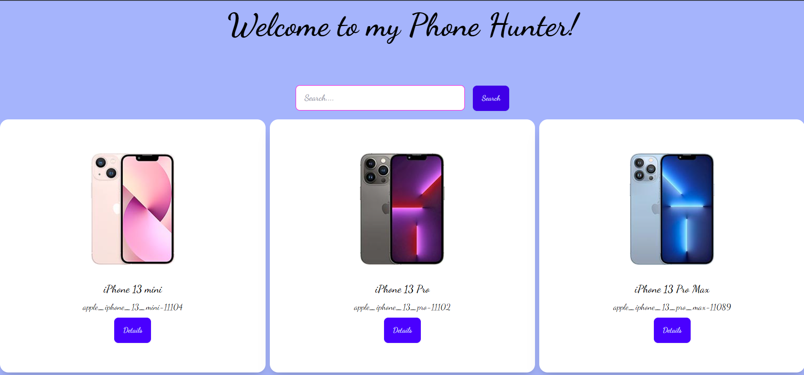
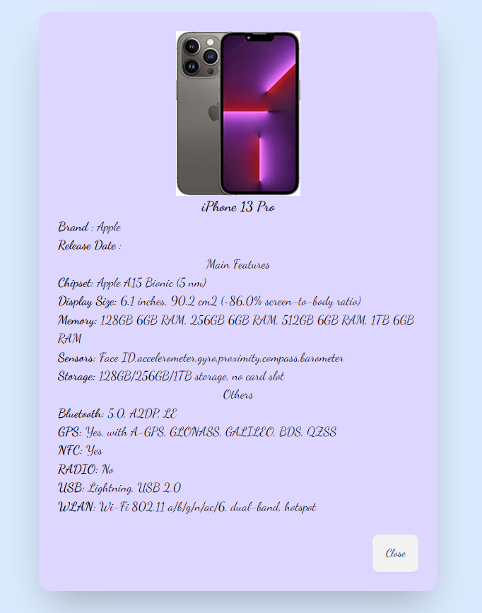

# phone-hunter-api

## API Links

### Phone Search
URL Format: https://openapi.programming-hero.com/api/phones?search=${searchText}

Example: https://openapi.programming-hero.com/api/phones?search=iphone

### Phone detail url:
URL Format: https://openapi.programming-hero.com/api/phone/${id}

Example: https://openapi.programming-hero.com/api/phone/apple_iphone_13_pro_max-11089

### Project Goal :

This website shows how json data is fetched and shown in the ui. The image - 

